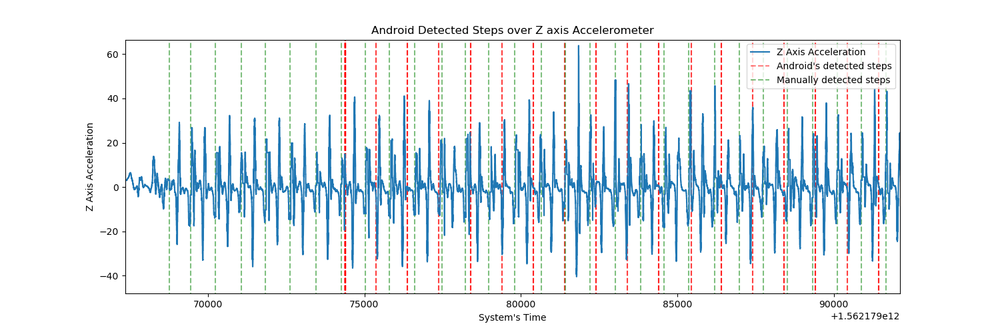
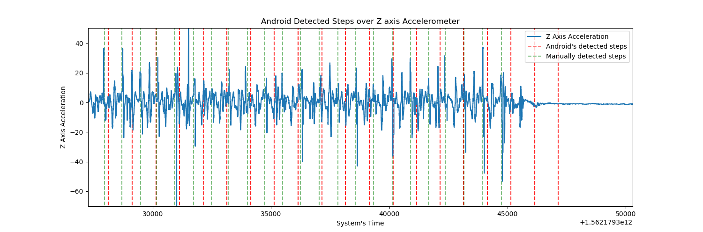
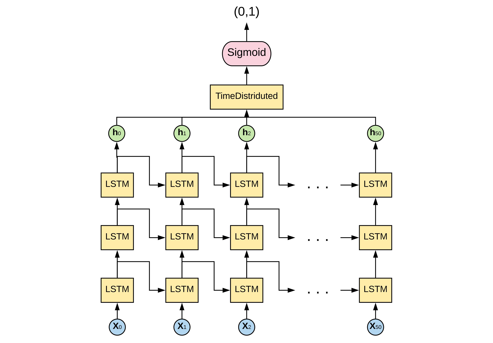
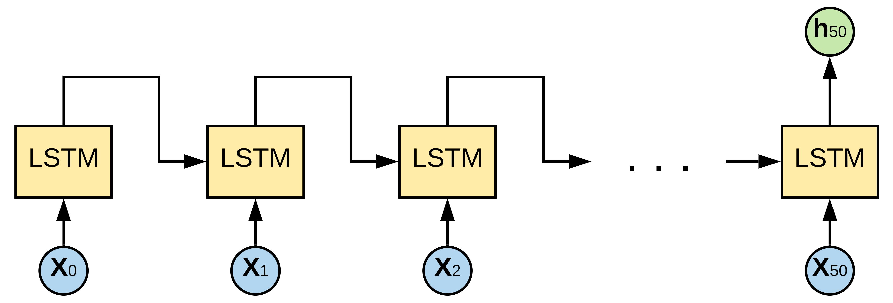
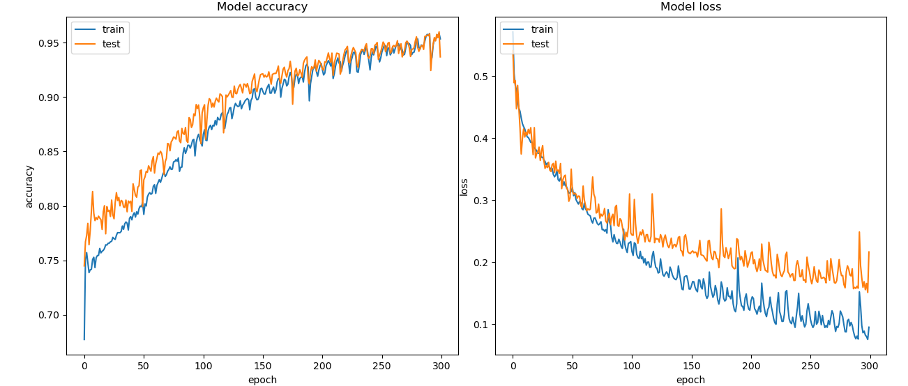
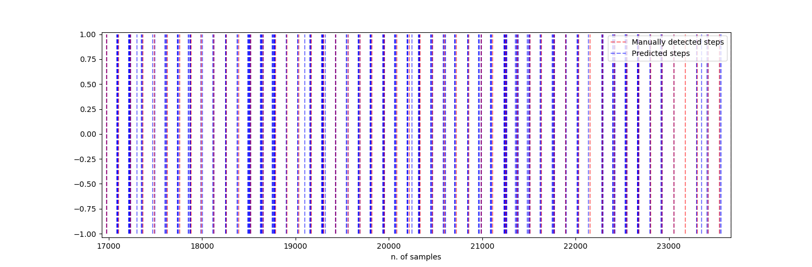

# Android Step Detector by means of LSTM NN

This project is the natural continuation of the **Android_Multiple_Sensors_recorder** one.

It has been chosen to record multiple running sessions of 10 minutes because it requires lot of attention to the user to manually record all the performed steps.

## Data Analysis and Preprocessing

From the resulting CSV files, it has been used just the portion of the from the first to last recorded Step, to avoid noisy and not useful data from the start and end of the running session, as placing the phone in the pocket and take it out to stop the recording.

All these data, with the use of a script have been collected on a single and more manageable dataset.

aX | aY | aZ | gX | gY | gZ | systemTime | Date | manualStep | androidStep | eventType
---|----|----|----|----|----|------------|------|------------|-------------|----------
6.366.455 | 16.283.463 | 31.590.118 | 0.5065918 | 27.833.252 | -4.200.012 | 1,56218E12 | 2019-07-03 19:37:48.734 | 0 | 0 | accelerometer
6.366.455 | 16.283.463 | 31.590.118 | 0.6930237 | 27.993.011 | -4.180.847 | 1,56218E13 | 2019-07-03 19:37:48.734 | 0 | 0 | gyroscope
6.366.455 | 16.283.463 | 31.590.118 | 0.6930237 | 27.993.011 | -4.180.847 | 1,56218E14 | 2019-07-03 19:37:48.759 | 1 | 0 | manualStepDetector
6.366.455 | 16.283.463 | 31.590.118 | 0.8517456 | 27.662.811 | -41.542.206 | 1,56218E15 | 2019-07-03 19:37:48.774 | 0 | 0 | gyroscope
<p align="center">
  <br>Tab.1 Dataset head<br>
</p>
This includes the values of the accelerometer and gyroscope over the 3 axes, an instance of time precise to the milliseconds, the Android detected steps, the manually detected steps(by clicking the headphones button) and an indication of the type of event.

It has been decided to not use the Android detected steps since how it is visible they are not precise and will compromise the learning of the NN model.
<p align="center">
  
  <br>Fig.1 Start of a running session<br>
  
  <br>Fig.2 End of a running session<br>
</p>

There is indeed a delay at the start of the recording them as well as the stopping, not to mention how they are not very precise.

Considering how each data point in the *ManualStep* column has a 1 if it is a step and a 0 it is a different event, it is possible to classify them as two classes: *"Step"* and *"Non-Step"*, obtaining a supervised learning problem.

Nevertheless analysing the dataset obtained it is easily recognisable how there is a significant unbalance between the two classes, having 8 424 Step against 3 090 476 Non-Step.

Total entries | Android's detected steps | Manually detected steps | Accelerometer events | Gyroscope events
--------------|--------------------------|-------------------------|----------------------|-----------------
3098900 | 16636 | 8424 | 1536917 | 1536923
<p align="center">
  <br>Tab.2 Final dataset description<br>
</p>
Moreover, Fig.1 and Fig.2 also shown how the accuracy of matchings, between acceleration peeks and manually detected steps, is good, but obviously not perfect. It can be addressed to the
human imprecision and potentially still some delay between the moment when the earphone button is pressed and when it is recorded.

The solution applied to minimise both the unbalance and the imprecision, as well as reduce the jittery of the line is to apply a revisited implementation of the moving average, where the values are grouped according to a selected *mean_value* and, over these, it is calculated the average.

```python
def mov_avg_on_features ( df , mean_value ) :
  df_avg = df.groupby(np.arange(len(df.index))//mean_value).mean()
  return df_avg
```

```python
def mov_avg_on_labels ( labels, mean_value ) :
  lab = lab.groupby(np.arange(len(labels.index))//mean_value).max()
  return lab
```
This will reduce the unbalancing of the dataset, reducing the number of total samples without, however, decrease the number of instances of the Step class.

<table>
  <tr><th colspan=2>Original Dataset</th><th colspan=2>Dataset resulted with mean_value of 3</th></tr>
  <tr><td>Tot. samples</td><td>Steps</td><td>Tot. samples</td><td>Steps</td></tr>
  <tr><td>3098900</td><td>8424</td><td>1032950</td><td>8407</td></tr>
</table>

Nonetheless, it can be noticed a minor reduction. This is, however, a desirable consequence, since, as previously mentioned, the running session has been trimmed to the first and last steps to have a dataset containing only running data, therefore on the junctions between files two consecutive data-point will results as two steps one after the other. These can mislead the model; hence with this method, they are merged resulting in a single entry.

Finally considering how in Tab.1 Accelerometer and Gyroscope values can have a high variance in their measurements, to have more normalised data has been scaled to fit in a range between -1 and 1 with the **`Scikit-learn`**  `MaxAbsScaler()`.

## Data Classification and Training

To have a benchmark two main algorithms have been tested to approach the step detection problem:
1. **Support Vector Machines**, particularly recommended for binary classification problems and proved to be able to get excellent results even using a small dataset.
2. **Long Short Term Memory Neural Network**, specially designed for time series problems, with the ability to remember previous temporal steps and produce prediction according to these.

### SVM

To test this approach it has been used again the **`scikit-learn`** library. 
However,  it has not been possible, during the training phase, to assign weights to balance the two classes, neither at a class level nor at samples level. 

It has been indeed observed how trying to train the model with this configuration would result in an endless process.

It is probably possible to make that work, although because of the limited time available an easier solution has been applied, i.e. create a new dataset selecting just the row containing a step and then randomly add the same amount rows, to balance the two classes.

```python
scaled_df = pd.read_csv('50_3_avg_X.csv')
labels = pd.read_csv('50_3_avg_y.csv')
#joining features and labels datasets
scaled_df['labels'] = labels.values
new_df = pd.DataFrame()
#create a new balanced dataframe
for i in range(1):   
    df_1 = scaled_df.loc[scaled_df['labels'] == 1]
    df_0 = scaled_df.sample(n=df_1.shape[0])
    temp_df = df_1.append(df_0)
    new_df = new_df.append(temp_df)
    print("new_df.shape",new_df.shape)
#divide features and labels
X = new_df.sample(frac=1)
y = X['labels']
del X['labels']
```

The size of this created dataset has been then also doubled and multiplied by ten, always selecting different random non-step rows, to test the learning over a diverse amount of training data.

Two typologies of SVM has been tested, the **`Linear SVM`** and **`Non-linear SVM`**.

As can be noticed the accuracy, precision and recall, along with the record of the number of real and predicted steps havebeen measured over the 3 created datasets. Nevertheless, being these appositely made up to training purposes, the algorithms have been tested even over the original averaged dataset and the same validation dataset of the LSTM.

<table>
    <tr>
      <th colspan=4>Created Balanced Dataset</th>
      <th colspan=5>Prediction over Balanced Validation</th>
      <th colspan=5>Prediction over Original Dataset</th>
      <th colspan=5>Prediction over Same Validation as LSTM</th>
    </tr>
    <tr>
        <td></td>
        <td>Total samples</td>
        <td>Training samples</td>
        <td>Validation samples</td>
        <td>Actual steps</td>
        <td>Predicted steps</td>
        <td>Accuracy</td>
        <td>Precision</td>
        <td>Recall</td>
        <td>Actual steps</td>
        <td>Predicted steps</td>
        <td>Accuracy</td>
        <td>Precision</td>
        <td>Recall</td>
        <td>Actual steps</td>
        <td>Predicted steps</td>
        <td>Accuracy</td>
        <td>Precision</td>
        <td>Recall</td>
    </tr>
    <tr>
        <td class="border-bottom">Training over 10X Dataset</td>
        <td class="border-bottom align-center">168140</td>
        <td class="border-bottom align-center">117698</td>
        <td class="border-bottom align-center">50442</td>
        <td class="border-bottom align-center">25585</td>
        <td class="border-bottom align-center">22987</td>
        <td class="border-bottom align-center">0.70</td>
        <td class="border-bottom align-center">0.73</td>
        <td class="border-bottom align-center">0.65</td>
        <td class="border-bottom align-center">8407</td>
        <td class="border-bottom align-center">253934</td>
        <td>0.75</td>
        <td class="border-bottom align-center">0.02</td>
        <td class="border-bottom align-center">0.65</td>
        <td class="border-bottom align-center">2539</td>
        <td class="border-bottom align-center">74495</td>
        <td class="border-bottom align-center">0.76</td>
        <td class="border-bottom align-center">0.02</td>
        <td class="border-bottom align-center">0.61</td>
    </tr>
    <tr>
        <td class="border-bottom">Training over 2X Dataset</td>
        <td class="border-bottom align-center">33628</td>
        <td class="border-bottom align-center">23539</td>
        <td class="border-bottom align-center">10089</td>
        <td class="border-bottom align-center">5063</td>
        <td class="border-bottom align-center">4666</td>
        <td class="border-bottom align-center">0.71</td>
        <td class="border-bottom align-center">0.73</td>
        <td class="border-bottom align-center">0.67</td>
        <td class="border-bottom align-center">8407</td>
        <td class="border-bottom align-center">259276</td>
        <td class="border-bottom align-center">0.75</td>
        <td class="border-bottom align-center">0.02</td>
        <td class="border-bottom align-center">0.66</td>
        <td class="border-bottom align-center">2539</td>
        <td class="border-bottom align-center">75642</td>
        <td class="border-bottom align-center">0.75</td>
        <td class="border-bottom align-center">0.02</td>
        <td class="border-bottom align-center">0.62</td>
    </tr>
    <tr>
        <td class="border-bottom">Training over 1X Dataset</td>
        <td class="align-center">16814</td>
        <td class="align-center">11769</td>
        <td class="align-center">5045</td>
        <td class="align-center">2516</td>
        <td class="align-center">2320</td>
        <td class="align-center">0.71</td>
        <td class="align-center">0.73</td>
        <td class="align-center">0.67</td>
        <td class="align-center">8407</td>
        <td class="align-center">261426</td>
        <td class="align-center">0.75</td>
        <td class="align-center">0.02</td>
        <td class="align-center">0.66</td>
        <td class="align-center">2539</td>
        <td class="align-center">76444</td>
        <td class="align-center">0.75</td>
        <td class="align-center">0.02</td>
        <td class="align-center">0.62</td>
    </tr>
</table>
<p align="center">
  <br>Tab.3 Prediction results of Linear SVM<br>
</p>

Although the not brilliant performances shown in Tab.3 was expected, however, the negligible improvements obtained with the non-linear SVM in Tab.4 has been a bit disappointing.

<table class="data-table">
    <tr>
      <th colspan=4>Created Balanced Dataset</th>
      <th colspan=5>Prediction over Balanced Validation</th>
      <th colspan=5>Prediction over Same Validation as LSTM</th>
    </tr>
    <tr>
        <td></td>
        <td>Total samples</td>
        <td>Training samples</td>
        <td>Validation samples</td>
        <td>Actual steps</td>
        <td>Predicted steps</td>
        <td>Accuracy</td>
        <td>Precision</td>
        <td>Recall</td>
        <td>Actual steps</td>
        <td>Predicted steps</td>
        <td>Accuracy</td>
        <td>Precision</td>
        <td>Recall</td>
    </tr>
    <tr>
        <td class="border-bottom">Training over 10X Dataset</td>
        <td class="border-bottom align-center">168140</td>
        <td class="border-bottom align-center">117698</td>
        <td class="border-bottom align-center">50442</td>
        <td class="border-bottom align-center">25468</td>
        <td class="border-bottom align-center">26950</td>
        <td class="border-bottom align-center">0.77</td>
        <td class="border-bottom align-center">0.76</td>
        <td class="border-bottom align-center">0.80</td>
        <td class="border-bottom align-center">2539</td>
        <td class="border-bottom align-center">80292</td>
        <td class="border-bottom align-center">0.75</td>
        <td class="border-bottom align-center">0.03</td>
        <td class="border-bottom align-center">0.82</td>
    </tr>
    <tr>
        <td class="border-bottom">Training over 2X Dataset</td>
        <td class="border-bottom align-center">33628</td>
        <td class="border-bottom align-center">23539</td>
        <td class="border-bottom align-center">10089</td>
        <td class="border-bottom align-center">5166</td>
        <td class="border-bottom align-center">5422</td>
        <td class="border-bottom align-center">0.74</td>
        <td class="border-bottom align-center">0.74</td>
        <td class="border-bottom align-center">0.77</td>
        <td class="border-bottom align-center">2539</td>
        <td class="border-bottom align-center">85207</td>
        <td class="border-bottom align-center">0.73</td>
        <td class="border-bottom align-center">0.02</td>
        <td class="border-bottom align-center">0.77</td>
    </tr>
    <tr>
        <td class="border-bottom">Training over 1X Dataset</td>
        <td class="align-center">16814</td>
        <td class="align-center">11769</td>
        <td class="align-center">5045</td>
        <td class="align-center">2562</td>
        <td class="align-center">2585</td>
        <td class="align-center">0.75</td>
        <td class="align-center">0.75</td>
        <td class="align-center">0.76</td>
        <td class="align-center">2539</td>
        <td class="align-center">78277</td>
        <td class="align-center">0.75</td>
        <td class="align-center">0.02</td>
        <td class="align-center">0.75</td>
    </tr>
</table>
<p align="center">
  <br>Tab.4 Prediction results of Non-Linear SVM<br>
</p>

The first noteworthy thing to notice is how the algorithm is not able to transfer the decent performances obtained over the created training dataset to the validation data, noticeably in the drastic drop of precision and the astronomical number of detected steps.

Moreover, non-linear classification produced better results over the validation dataset; nevertheless, these were not entirely reflected over the original data.

Finally, It can also be seen in how although the increase of the dataset's size has made it possible better results in the training evaluation dataset; however, these are again not significantly reflected over the original dataset.
This somehow indicates how this approach, as it has been applied, is not suitable for this problem since, no matter how will be increased the amount of data recorded, it will not produce better performances.

### LSTM NN

The structure of this model includes the use of 3 `LSTM` recursive layers with the dimensions of 50 time-steps and 6 features. 
This configuration has been tested with a `TimeDistributed` final layer.This will allow predicting one value per time-step considering the full sequence provided as input( all the 50 time-steps). 

This network has been implemented using the **Keras** framework.
<p align="center">
  
  <br>Fig.3 Step Detection model LSTM Architecture<br>
</p>

In Fig.3  it can be seen how each cell is passing its **hidden state** *(ht)* to the cell at its right, affecting its **cell state** *(ct)*, but also is used as input to the following layer.
This particular behaviour is activated by the parameter return_sequence=True. Oppositely, if set to False, as it is shown in Fig.4, it is just returned to the next layer the *(ht)* of the final cell.
<p align="center">
  
  <br>Fig.4 LSTM layer with return_sequence=False<br>
</p>

It must be furthermore mentioned that the `activation='tanh'` and `recurrent_activation='hard_sigmoid'` of layers hasn't been modified, as after some testing over `relu` and `PReLU`, still resulted the ones with better performances.

Finally, it has been assigned to the TimeDistributed layer a sigmoid activation function to produce an output between 0 and 1, since this is a binary classification problem.

This model has then been compiled using `binary_crossentropy` to compute the cross-entropy loss between true labels and predicted labels, `Adam` optimiser and metrics `accuracy`.

It should also be mentioned that differently from the previously explained SVM model, here it has been possible to use the calculated weights.

This network has been then trained over 300 epochs, using a `batch_size` of 32 (Fig.5). 
<p align="center">
  
  <br>Fig.5 Accuracy and Binary Crossentropy loss development over training on 300 epochs<br>
</p>
Since it has not shown sign of overfitting or major stops in learning, the saved best weights have been loaded again and trained other 300 times.

Finally, the obtained optimal weights founded have then been tested with shorter training using a final `Dense` Layer, to test the difference in performances between this and the `TimeDistributed` one.

<table class="data-table">
    <tr>
        <th></th>
        <th colspan=5>Prediction over Validation Dataset</th>
    </tr>
    <tr>
        <td class="border-bottom"></td>
        <td class="border-bottom align-center">Steps</td>
        <td class="border-bottom align-center">Predicted</td>
        <td class="border-bottom align-center">Accuracy</td>
        <td class="border-bottom align-center">Precision</td>
        <td class="border-bottom align-center">Recall</td>
    </tr>
    <tr>
        <td class="border-bottom">LSTM Dense final layer</td>
        <td class="border-bottom align-center">2539</td>
        <td class="border-bottom align-center">5250</td>
        <td class="border-bottom align-center">0.99</td>
        <td class="border-bottom align-center">0.05</td>
        <td class="border-bottom align-center">0.10</td>
    </tr>
    <tr>
        <td class="border-bottom">LSTM TimeDistributed final layer</td>
        <td class="border-bottom align-center">2539</td>
        <td class="border-bottom align-center">4913</td>
        <td class="border-bottom align-center">0.99</td>
        <td class="border-bottom align-center">0.05</td>
        <td class="border-bottom align-center">0.10</td>
    </tr>
    <tr>
        <td class="border-bottom">SVM</td>
        <td class="align-center">2539</td>
        <td class="align-center">78277</td>
        <td class="align-center">0.75</td>
        <td class="align-center">0.02</td>
        <td class="align-center">0.75</td>
    </tr>
</table>
<p align="center">
  <br>Tab.5 Prediction results final comparison between tested algorithms<br>
</p>

As can be observed, surprisingly similar results have been achieved using the Dense layer. This could be probably addressed to the learning mechanism of each cell and how the previous context is already considered with the *forget* and *input gate*. Therefore it could be that this is already the sufficient amount of information needed and having to decide over each data-point.

It should also be mentioned there is still margin for optimisation over the weights, since at any point the learning curve stopped. It is indeed likely that with more training and a greater dataset, the accuracy of the model will further improve reaching results that are more than acceptable for the project's purposes.

<p align="center">
  
  <br>Fig.6 Comaprison between placements of manually detected and predicted steps<br>
</p>

As a final analysis, it can be observed how the misdetected steps are located compared to the manually detected ones. It is interesting to notice how instead of being predicted randomly they are grouped around the actual steps.

This leads to the formulation of two observation: 
* firstly, the initial belief that the model could use the available context, even as a sort of autocorrelation function to predict where the next possible step will be, could not be entirely accurate; since more than one is predicted where there should be just one.
* Secondly, it means that, to improve prediction accuracy, it will be simply possible to don't use the Keras provided predict_classes method, but instead the predict one. This will return the probability of a step in a range between 0 and 1 allowing to apply then another algorithm that will check if nearby there are already some predicted steps and if so keeps the one with the highest probability. This should reduce the number of multiple detections for the same step, leaving just the issue of the not predicted steps, as can on the extreme right of Fig.6.

## Final thoughts

The approach proposed to can be considerate a remarkable result, compared to the lack of resources and time available.
It has indeed been achieved similar results to the Android's built-in step counter, with both detecting approximately the double of the actual steps.
Not to mention how, with simple Improvements, i.e. a further long training, the use of more accurate methodologies in the collecting of the data and the implementation of an algorithm to refine the model predictions, it's very likely to obtain better performaneces than the ones achieved by the Android's detector.


